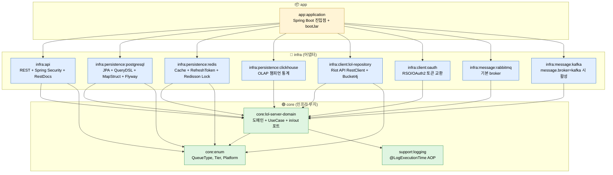
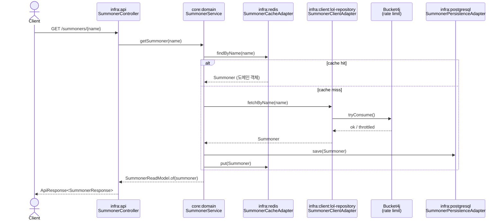
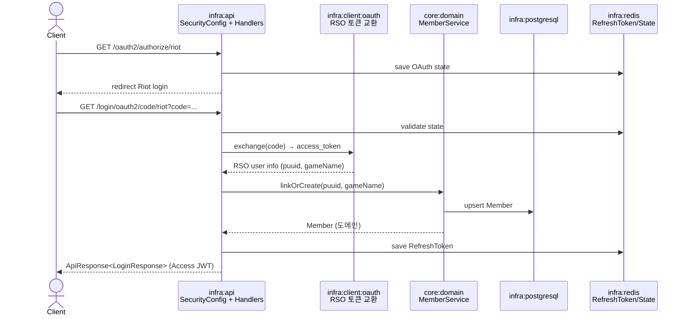
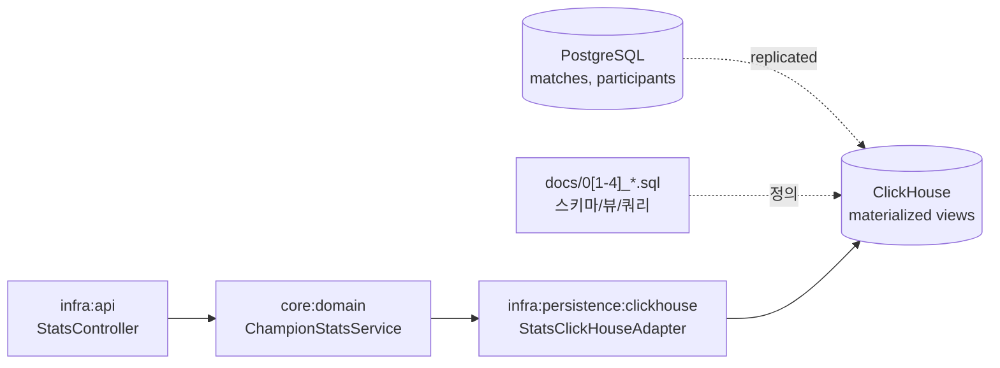

# Architecture

`lol-server` 의 모듈 의존성과 데이터 흐름을 한 페이지로 정리한 문서. 변경 영향 범위 추적이 목적이며, 각 모듈의 컨벤션은 해당 `CLAUDE.md` 를 참조한다.

## 핵심 원칙

- **헥사고날 (Ports & Adapters)**: 의존은 항상 `infra → core` 단방향. 역방향 (`core → infra`) 은 빌드 시 거절.
- **컴포지션 루트**: `module/app/application` 만 모든 모듈을 알고 빈을 묶는다. 다른 인프라 모듈끼리는 서로 모름.
- **도메인 무지성 (domain ignorance)**: `core/lol-server-domain` 에는 `@Entity`, `RestClient`, `RedisTemplate` 같은 인프라 타입이 들어오면 안 된다.

## 모듈 의존 그래프

**읽는 법**:
- 화살표 = 컴파일 타임 의존 (`build.gradle` `implementation project(...)`)
- `core` 박스 안 모듈 사이에만 의존이 허용. `infra → infra` 직접 의존은 금지.
- `app:application` 은 모든 어댑터를 빈으로 등록하기 위해 모든 인프라를 알지만, 어댑터끼리는 도메인 포트를 통해서만 상호작용.

## 주요 데이터 흐름

### 1. 전적 조회 (Riot API → Cache → Controller)

### 2. OAuth2 / RSO 로그인

자세한 시나리오·트러블슈팅은 [`docs/oauth2-login.md`](oauth2-login.md), [`docs/rso-oauth2-troubleshooting.md`](rso-oauth2-troubleshooting.md).

### 3. 챔피언 통계 (ClickHouse OLAP)

PostgreSQL OLTP 데이터를 ClickHouse 로 복제 후 materialized view 로 집계, 도메인 서비스는 `ChampionStatsClickHousePort` 를 통해서만 접근.

## "X 가 변경되면 어디가 영향받는가?" 빠른 답

| 변경 대상 | 직접 영향 모듈 | 간접 검증 필요 |
|---|---|---|
| `core:enum` (e.g. `QueueType` 추가) | 모든 infra 모듈 | 매직 스트링 미사용 검증 (`.name()` 호출 지점) |
| `core:lol-server-domain` 의 in port (UseCase) 시그니처 | `infra:api` 컨트롤러 | 도메인 서비스 구현 |
| `core:lol-server-domain` 의 out port 시그니처 | 모든 인프라 어댑터 (`*Adapter`) | `app:application` 빈 주입 |
| 도메인 객체 필드 추가 | `infra:postgresql` (Entity + Mapper), `infra:api` (ReadModel/Response), `infra:redis` (직렬화) | RestDocs 스냅샷, MapStruct 테스트 |
| Flyway 마이그레이션 (`lol-db-schema/`) | `infra:postgresql` | local/dev DB 재생성, 운영 배포 순서 |
| Riot API VO (`restclient/.../model/*VO.java`) | `infra:client:lol-repository` 만 | Mapper 단위 테스트 (도메인은 모름) |
| `application-*.yml` (프로파일) | `app:application` 런타임 | `local`/`dev`/`prod` 환경 차이 검증 |
| `message.broker` 프로퍼티 | `app:application` | `infra:message:rabbitmq` ↔ `kafka` 활성 분기 |
| `SecurityConfig` (`controller/security/`) | `infra:api` | 보호된 엔드포인트 화이트리스트, JWT 필터 체인 |

## See Also

- [Root CLAUDE.md](../CLAUDE.md) — 모듈 표 + 코드 컨벤션 요약
- 모듈별 디테일: 각 `module/<x>/CLAUDE.md`
- [`docs/workflow.md`](workflow.md) — Linear(`MP-*`) 키 기반 브랜치/커밋 룰
- [`docs/01_pg_source_tables.sql`](01_pg_source_tables.sql) ~ [`04_queries.sql`](04_queries.sql) — ClickHouse 스키마/뷰/쿼리
